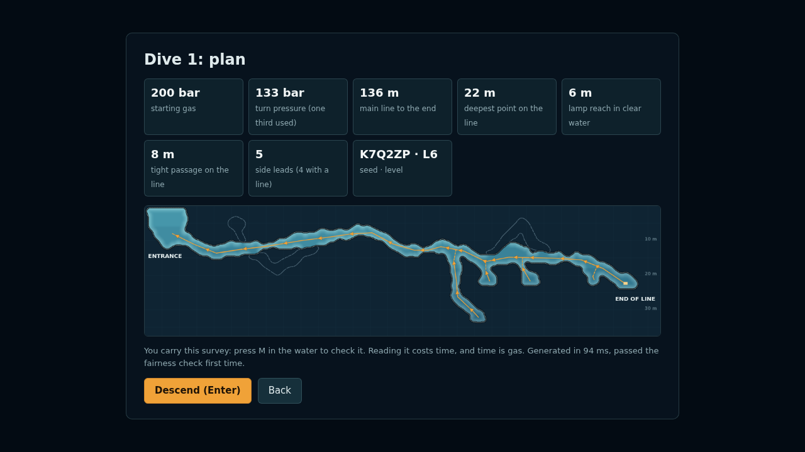
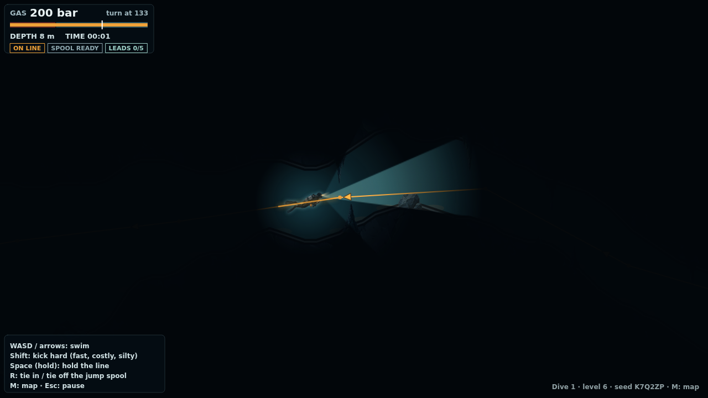
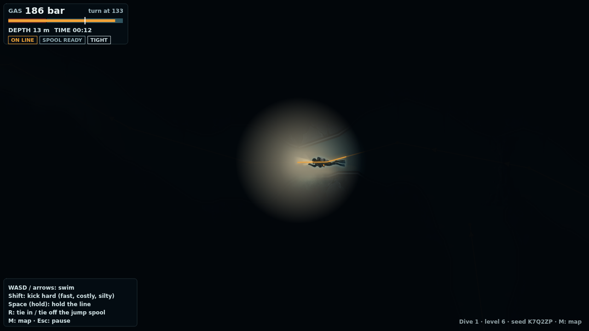
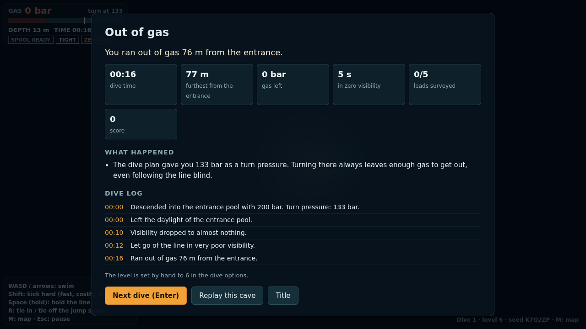

# Week 4: Procedural Content Generation (PCG)

## Team

- Abdulla Saeed Ghanim Abdulla Alfalasi (asg8972)
- Naxin Chen (nc3840)
- Steven Li (sl10429)

## Mission

Build a game prototype that incorporates PCG: generate the levels, or something else. Using Jev is optional.

## What we built

**Cave Diving** (working title) is a browser game about a solo diver in a generated, flooded cave, seen in side cross-section. The diver follows an amber guideline in, tags the end of the line in the far chamber, and swims back out to the entrance pool before their gas runs out. The tension is when to turn back. Every metre in costs gas, and so does the way out. Kicking up silt makes the way back harder, and over a run of dives the game shows the player less of the map.

This is prototype 2. Prototype 1 (a subway transfer game called Late) is developed separately on the `pcg-prototype` branch. Requirements and ideas are in [`idea.md`](idea.md).

| In the cave | Silt-out on the way back | After a failed dive |
| --- | --- | --- |
|  |  |  |

### How to play

- **WASD / arrow keys:** swim. **Shift:** kick hard (faster, but it uses more gas and stirs up much more silt).
- **Space (hold):** keep a hand on the line. While you hold it you move along it, even in zero visibility. When your hand passes one of the line arrows, you can feel which way the exit is.
- **R:** tie your one 30 m spool into a line, lay it as you swim, and press R again to tie it off. Use it to bridge the gap to a branch line or to leave a line into a side passage.
- **M:** survey map, when this dive allows one. **H:** show or hide the controls. **Esc:** pause.

You start with 200 bar. The gauge marks the turn pressure, 133 bar, which is where a third of your gas is gone. Side passages end in unsurveyed leads, worth points only if you get home. After every dive, the game writes a short log of what happened from your run and points out the decisions that cost you.

## How our PCG works

Every dive comes from a **seed** and a **level**. The same seed and level always give the same cave (`?seed=K7Q2ZP&level=6`). The level sets the generator's parameters: cave length, number of side branches and loops, number of squeezes, how silty the floor is, lamp reach, how deep the passage trends, and the gas margin. The generator is a pipeline in [`src/gen.js`](src/gen.js):

1. **Cave graph.** A main passage is laid as a chain of nodes that trends deeper with level. Some nodes become chambers, and the last one is the goal chamber. Side branches (dead ends) and loops (detours that rejoin the main passage further in) are added only where they keep clear of existing passages. A number of main-passage edges are marked as squeezes.
2. **Carving.** Each edge becomes a wiggly centre line, and discs are carved along it into a 0.5 m grid. Wall noise roughens the rock, chambers get flat floors, and squeezes narrow to about 1.5 m across. One smoothing pass removes spikes, and any water not connected to the entrance pool is filled back in.
3. **Clearance.** An exact distance transform gives every water cell its distance to rock. That decides where the diver fits and where a passage is tight.
4. **Guideline.** The main line is tied off in the entrance pool and laid along the main passage to the goal. Tie-offs are placed so every straight stretch of line has room for the diver along it. Arrows go on the line pointing toward the exit. Some side branches get their own line that starts a short gap away from the main line, so reaching it means crossing a gap (a jump). Every branch ends in an unsurveyed lead.
5. **Silt and decoration.** Silt beds are laid on floors, heaviest in squeezes and in the side passages, lighter along the main passage. Stalactites, columns, curtains, boulders and ledges from the sprite sheet are placed on ceilings and floors, more densely in the side passages.
6. **Fairness check and gas budget.** A gas-cost search (Dijkstra over the cells the diver fits through) prices each step by swim speed, squeezes and depth. The check requires that the goal is reachable, that the line runs through water the diver fits in, that the cave is long enough, and that the line doesn't detour much more than the shortest route. It then sets the breathing rate so that swimming the line to the goal costs a third of the gas divided by the level's margin. Finally, it confirms that the worst-case trip out fits in the remaining two thirds: silted out the whole way, following the line by touch at reduced speed, with stress breathing. A cave that fails any of these is regenerated from a derived seed.

Two more things are generated from the run itself:

- **Silt is state that depends on your path.** Silt you stir up spreads and settles slowly in a simulation during the dive. The silt you make on the way in is waiting for you on the way out, so the order of your moves matters, not just the route.
- **The post-mortem is built from the run log.** The game records events as they happen (turn pressure, the turn, zero visibility, letting go of the line, lost contact, leads, switching lines). It then fills hand-written text templates with that data, for example: "The silt you kicked up at 00:34 was still hanging there at 02:59."

**Between dives,** a simple director adjusts the level. Tagging the end of the line and getting home moves you up a level, running out of gas moves you down, and turning back safely keeps you where you are. With the options on Auto, the map also shrinks as the level rises: a full survey you can check any time, then a survey you can only read at the entrance, then no map at all. This changes what is shown, not what is generated.

Hand-made parts: the rules, the text templates, and the art.

## How PCG adds to our game

- **You can't memorise the route.** Every dive is a new cave, so the decision to turn back has to be made on the spot, with the gauge and whatever you saw.
- **Difficulty is a set of dials.** Length, depth, squeezes, side branches, silt, lamp reach and gas margin all come from one level number. That is what lets the director move a player up or down one step at a time.
- **Failures come from decisions, not from the cave.** Every cave passed the check above, so a diver who turns at turn pressure while on the main line, and follows it out, always gets home. When a dive fails, the post-mortem can point to the player's decisions and not to an unfair map.
- **Side branches create choices.** Leads and branch lines are placed in every cave to pull the player off the main route, and they cost gas the player planned to keep for the way home.

## Checking the generator

Two scripts in [`tools/`](tools/) run the game headless in Node.

`node tools/check_gen.js 200 9` generated 2,000 caves (200 seeds at each level from 0 to 9). Every one passed the fairness check on its first attempt, and the same seed and level gave the same cave. During tuning, the same check rejected up to half the caves at higher levels, when squeezes were carved narrower than the diver. That is how we found and fixed that problem. The measures grow with level:

| Level | Main line | Deepest point | Tight passage on the line | Side leads | Gas to reach the goal |
| --- | --- | --- | --- | --- | --- |
| 0 | 72 m | 17 m | 0 m | 1 | 46 bar |
| 3 | 107 m | 25 m | 2 m | 3 | 51 bar |
| 6 | 142 m | 36 m | 6 m | 5 | 58 bar |
| 9 | 166 m | 44 m | 10 m | 7 | 62 bar |

`node tools/autopilot.js 30 9` dives 30 caves at each of levels 0, 3, 6 and 9 with a scripted diver that holds the line, in three ways:

| Autopilot | Got home | Gas left (worst case across levels) |
| --- | --- | --- |
| Normal kick, in to the goal and straight back | 120 / 120 | 78 bar |
| Kicking hard the whole way | 120 / 120 | 39 bar |
| Lingering at the goal until turn pressure, then zero visibility all the way out | 120 / 120 | 11 bar |

The last row is the guarantee the check is meant to give. A diver who turns at turn pressure while on the main line, and keeps a hand on it, always gets out, even blind. The guarantee does not cover gas spent away from the main line, such as in a side lead after turn pressure.

## Art

The art concept and sprite sheets were made first with ChatGPT image generation and are kept separate from the game code, in `resources/`. The direction is 2D, in teal, ink blue and slate grey, with amber reserved for the guideline and the diver's lamp.

- `resources/cave_concept_1.png`: side-view scene of the diver following the guideline, with a narrow lamp cone and silt behind. It is the title screen background, and it set the in-game view.
- `resources/cave_concept_2.png`: top-down survey-style map with depth bands, a guideline with markers, a dashed jump between lines, and faint outlines of unexplored areas. The in-game survey map follows this style.
- `resources/cave_sprite.png`: diver sprite sheet (idle, swim, up and down, squeeze, reach and clip, stirring silt).
- `resources/cave_sprite2.png`: cave tiles, rock and stalactite props, guideline pieces, silt puff frames, lamp cones and bubbles.

The generated sheets are not on a grid, so [`tools/cut_sprites.py`](tools/cut_sprites.py) cuts them into `resources/sprites/`. It finds each frame, removes the grey background (turning the lamp glow and silt puffs into real transparency), aligns animation frames on their centre of mass, and makes a rock tile that repeats without seams. Run it with `python3 tools/cut_sprites.py` (needs `pillow`, `numpy` and `scipy`). The game uses the idle, swim and squeeze diver frames, the silt puffs, the props and one rock tile. The line, arrows, lamp and bubbles are drawn in code.

## How to run

No build step and no dependencies: open `index.html` in a browser. It also works from a local server (`python3 -m http.server`, then open http://localhost:8000).

- URL options: `?seed=K7Q2ZP&level=6&map=none` (`map` is `full`, `entrance` or `none`). The same choices are under "Dive options" on the title screen.
- Progress (dive number and level) is kept in the browser's local storage. "Reset progress" on the title screen clears it.
- Generator and balance checks: `node tools/check_gen.js [seeds per level] [max level]` and `node tools/autopilot.js [dives] [max level]`.

We have only measured frame rate in headless Chromium without a GPU: about 29 fps at 1600×900. It has not been measured in a desktop browser yet.

## Cave diving background

The rules in the game are simplified from real cave diving practice. We checked each point below against search excerpts of the linked sources. Our network proxy blocked the full pages, so please read the originals before relying on them.

- **Rule of thirds.** Many cave divers plan gas by using a third for going in, a third for getting out, and a third in reserve. The team turns when the first diver has used a third. It is treated as a minimum, and conditions such as flowing caves call for larger reserves. ([DAN](https://dan.org/alert-diver/article/cavern-and-cave-diving/), [TDI](https://www.tdisdi.com/tdi-diver-news/breaking-the-rule-of-thirds-gas-management-for-sidemount/))
- **Silt-outs.** Fine silt and clay on cave floors, walls and ceilings is easily stirred up by fins, contact, or even exhaled bubbles. It can drop visibility to near zero within seconds and can linger for a long time. We found no source for a settling time, so the game's is made up. ([DAN](https://dan.org/alert-diver/article/low-visibility-diving/), [NSS-CDS](https://nsscds.org/preventing_cave_damage/))
- **Continuous guideline.** Divers keep a continuous guideline to open water and follow it out by touch if visibility or lights are lost. ([DAN](https://dan.org/alert-diver/article/low-visibility-diving/), [TDI](https://www.tdisdi.com/tdi-diver-news/staying-connected-a-beginners-guide-to-lines-in-cave-diving/))
- **Line arrows.** Arrows on the line point toward the nearest exit, and divers can read them by touch. In real caves the nearest exit is not always the way the team came in. ([TDI](https://www.tdisdi.com/tdi-diver-news/cave-diving-directional-and-non-directional-markers-101/))
- **Jumps.** A jump is a short spool of line that links the main line to a branch line, so the line back to the exit stays unbroken. A "gap" is a different thing: a link across an intentional break in the main line. ([TDI](https://www.tdisdi.com/tdi-diver-news/staying-connected-a-beginners-guide-to-lines-in-cave-diving/))
- **Gas use at depth.** Ambient pressure is about (depth in m ÷ 10) + 1 atmospheres, so a diver uses gas about twice as fast at 10 m as at the surface. In fresh water it is closer to 10.3 m per atmosphere. ([DAN](https://dan.org/alert-diver/article/estimating-your-air-consumption/))
- **Overhead environment.** A diver in a cave can't swim straight up to the surface and has to travel back out along the line, usually the way they came. ([DAN](https://dan.org/alert-diver/article/cavern-and-cave-diving/))
- **Frog kick.** Cave divers often use the frog kick because its thrust goes backward rather than down toward the floor, so it stirs up less silt than a flutter kick. ([TDI](https://www.tdisdi.com/tdi-diver-news/the-top-three-finning-techniques-and-when-to-use-each-one/))
- **Accident analysis.** Sheck Exley's *Basic Cave Diving: A Blueprint for Survival* (NSS-CDS, 1979) traced most cave diving deaths to three failures: no continuous guideline to open water, not keeping two thirds of the gas for the exit, and diving too deep. Lack of training and too few lights were added later. ([NSS-CDS PDF](https://nsscds.org/wp-content/uploads/2018/05/Blueprint-for-Survival.pdf), [Buzzacott et al. 2009](https://scholarworks.bgsu.edu/ijare/vol3/iss2/7/))

The Bilibili channel [神秘园](https://space.bilibili.com/87670515), which tells real outdoor accident stories, was a reference for how bad outcomes build up from small decisions. The game borrows that structure only, and no real incident, place or person.

## Project layout

- `index.html`, `style.css`: the page and its screens.
- `src/rng.js`: seeded random numbers and value noise.
- `src/gen.js`: the cave generator and the fairness check.
- `src/game.js`: one dive (movement, the line and spool, silt, gas, the run log and the post-mortem).
- `src/render.js`: drawing (cave walls, lighting, silt, HUD, survey map).
- `src/main.js`: screens, input, the game loop and the between-dive director.
- `tools/`: sprite cutting and the headless checks.
- `resources/`: the generated art. `resources/sprites/` holds the cut sprites.
- `docs/`: screenshots for this README.

## Not built yet

- Telemetry and a leaderboard (the Week 3 Worker + D1 pattern) are not included. If added, they would need their own Worker and database, and the game must keep working without them.
- Jev is not used. The between-dive director is a simple one-level step.
- The teammate idea, sound, touch controls, and a map of the areas you have actually seen.

## Research notes

- [`research/sok-pcg.md`](research/sok-pcg.md): comparison of PCG content types, layout algorithms, and quality-control strategies.
- [`research/sok-pcg-genres.md`](research/sok-pcg-genres.md): how PCG is used across game genres.
