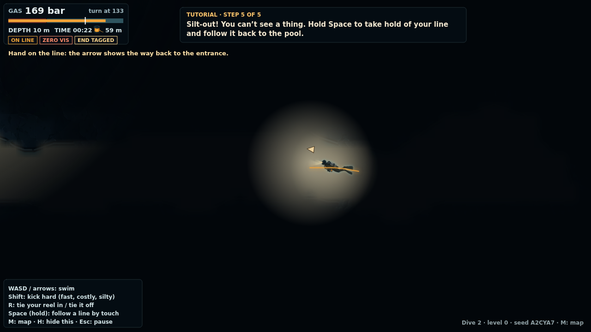

# Week 4: Procedural Content Generation (PCG)

## Team

- Abdulla Saeed Ghanim Abdulla Alfalasi (asg8972)
- Naxin Chen (nc3840)
- Steven Li (sl10429)

## Mission

Build a game prototype that incorporates PCG: generate the levels, or something else. Using Jev is optional.

## What we built

**Cave Diving** (working title) is a browser game about finding your way through a generated, flooded maze, seen in side cross-section. Nobody has laid a guideline for you. You tie your reel in at a post in the entrance pool, and it pays out line behind you as you search the dark passages for the end chamber. Then you have to get back to the pool before your gas runs out, and in a silt-out, the line you laid is the only way you will find it. Level 0 is a tutorial that teaches laying and following the line; the mazes start at level 1 and grow with each dive.

This is prototype 2. Prototype 1 (a subway transfer game called Late) is developed separately on the `pcg-prototype` branch. Requirements and ideas are in [`idea.md`](idea.md).

| Laying line in the maze | Tutorial: following the line out blind | After a failed dive |
| --- | --- | --- |
|  |  |  |

### How to play

- **WASD / arrow keys:** swim. **Shift:** kick hard (faster, but it uses more gas and stirs up much more silt).
- **R:** tie your reel in, then tie it off. You can tie in at the post in the pool, into a line you laid earlier, or to the rock. While the reel is tied in, it pays out line as you swim, and swimming back over the line reels it in, so backing out of a dead end doesn't leave line behind.
- **Space (hold):** keep a hand on a line and move along it, even in zero visibility. An arrow shows which way it runs back. Following the line you are still laying back toward its start reels it in as you go.
- **M:** survey map, when this dive allows one. It shows the passages, not the way through. **H:** show or hide the controls. **Esc:** pause.

You start with 200 bar. The gauge marks the turn pressure, 133 bar, where a third of your gas is gone. If your line runs unbroken from the post in the pool and you turn at turn pressure, you always have the gas to follow it out, even blind. After every dive, the game writes a short log of what happened and points out the decisions that cost you.

## How our PCG works

Every dive comes from a **seed** and a **level**. The same seed and level always give the same maze (`?seed=K7Q2ZP&level=4`). The level sets the generator's parameters: the maze's size, how many extra loops it has, how many squeezes, how silty the floors are, lamp reach, the gas margin and how much line is on the reel. Level 0 is a fixed-shape tutorial cave: one passage from the pool to an end chamber. The generator is a pipeline in [`src/gen.js`](src/gen.js):

1. **Maze graph.** Junctions are placed on a jittered grid (5×3 at level 1, up to 12×5). A growing-tree walk joins them into a spanning tree. It mostly extends the newest corridor, which makes long winding passages, and sometimes branches off an older one, which makes dead ends. A few extra edges add loops, so higher levels have more than one way through. The end chamber is the junction farthest from the entrance through the maze, and some junctions become chambers. A number of passages are marked as squeezes.
2. **Carving.** Each passage becomes a wiggly centre line, and discs are carved along it into a 0.5 m grid. Wall noise roughens the rock, chambers get flat floors, and squeezes narrow to about 1.5 m across. One smoothing pass removes spikes, and any water not connected to the entrance pool is filled back in.
3. **Clearance.** An exact distance transform gives every water cell its distance to rock. That decides where the diver fits and where a passage is tight.
4. **Silt and decoration.** Silt beds are laid on floors, heaviest in squeezes and dead ends and lighter on the through route. Stalactites, columns, curtains, boulders and ledges from the sprite sheet are placed on ceilings and floors.
5. **Fairness check, gas and reel.** A gas-cost search (Dijkstra over the cells the diver fits through) prices each step by swim speed, squeezes and depth. The check requires that the end chamber is reachable from the pool, that the maze is long enough, and that a realistic route (the shortest way, kept off the walls) doesn't detour far from the shortest possible. It then sets the breathing rate so that swimming that route to the end chamber costs a third of the gas divided by the level's margin. The margin is the room for wrong turns: 2.4× at level 1, shrinking to 1.5×. The reel gets enough line for the route times a slack factor. A maze that fails any of these is regenerated from a derived seed.

The turn-pressure guarantee holds for any maze, not just the checked route. The line pays out as you swim and reels in when you back up, so it is never longer than the distance you swam. Following it out by touch in zero visibility costs at most 1.1 / 0.6 ≈ 1.83 times the gas per metre of swimming it in (slower, and with stress breathing). If you turn after using a third, the way out costs at most 0.61 of your starting gas, which fits in the two thirds you have left.

Two more things are generated from the run itself:

- **Silt is state that depends on your path.** Silt you stir up spreads and settles slowly in a simulation during the dive. The silt you make on the way in is waiting for you on the way out, so the order of your moves matters, not just the route.
- **The post-mortem is built from the run log.** The game records events as they happen: tying in and off, dead ends, turn pressure, the turn, zero visibility, letting go of the line, and swimming away from it. It then fills hand-written text templates with that data, for example: "The silt you kicked up at 00:34 was still hanging there at 02:59."

**Between dives,** a simple director adjusts the level. Finishing the tutorial unlocks level 1. After that, tagging the end chamber and getting home moves you up a level, running out of gas moves you down, and turning back safely keeps you where you are. With the options on Auto, the map also shrinks as the level rises: a full survey you can check any time (levels 0–2), then a survey you can only read at the entrance (3–4), then no map at all. This changes what is shown, not what is generated.

Hand-made parts: the rules, the tutorial steps, the text templates, and the art.

## How PCG adds to our game

- **Every dive is a new maze.** You can't memorise the way through, so every junction is a decision made in the dark, with the gauge and whatever you remember of the survey.
- **Difficulty is a set of dials.** Maze size, loops, depth, squeezes, silt, lamp reach, gas margin and reel length all come from one level number. That is what lets the director move a player up or down one step at a time.
- **Failures come from decisions, not from the maze.** Every maze passed the check above, and the turn-pressure guarantee holds however you swim it. When a dive fails, the post-mortem can point to the player's decisions (a late turn, a line left behind, silt stirred up on the way in) and not to an unfair map.
- **Dead ends cost you twice.** The maze always has dead ends and, at higher levels, loops. Each wrong turn is paid for going in and coming back out, which is what makes the turn-pressure decision tense.

## Checking the generator

Two scripts in [`tools/`](tools/) run the game headless in Node.

`node tools/check_gen.js 200 9` generated 2,000 mazes (200 seeds at each level from 0 to 9). The same seed and level always gave the same maze. 10 of the 2,000 failed the fairness check on the first attempt and were regenerated from a derived seed: 7 because the realistic route detoured too far from the shortest possible, and 3 because the maze came out too short. Every seed gave a valid maze within two attempts. The measures grow with level:

| Level | Route to the end chamber | Route ÷ straight line | Line on the reel | Junctions | Dead ends | Deepest point on the route | Gas to swim the route in |
| --- | --- | --- | --- | --- | --- | --- | --- |
| 0 (tutorial) | 32 m | 1.05 | 85 m | 0 | 0 | 12 m | 22 bar |
| 1 | 101 m | 2.88 | 219 m | 2.2 | 2.2 | 29 m | 28 bar |
| 3 | 122 m | 2.32 | 244 m | 4.3 | 2.5 | 29 m | 31 bar |
| 6 | 177 m | 2.26 | 309 m | 10.3 | 4.9 | 38 m | 36 bar |
| 9 | 229 m | 2.40 | 349 m | 15.0 | 7.9 | 47 m | 44 bar |

(Averages over the 200 mazes at each level.)

`node tools/autopilot.js 30 9` dives 30 mazes at each of levels 0, 3, 6 and 9 with a scripted diver. It ties in at the post, swims the checked route laying line, ties off in the end chamber, then holds the line and follows it home. It does this in three ways:

| Autopilot | Got home | Gas used to reach the end chamber (mean, level 9) | Gas left (lowest, any level) |
| --- | --- | --- | --- |
| Normal kick, straight in and back | 120 / 120 | 42 bar | 115 bar |
| Kicking hard all the way in | 120 / 120 | 59 bar | 95 bar |
| Lingering at the end until turn pressure (133 bar), then zero visibility all the way out | 120 / 120 | 42 bar | 57 bar |

The last row is the guarantee in practice: a diver who turns at turn pressure with an unbroken line from the pool gets out, even blind. The direct route to the end chamber uses much less than a third of the gas. The rest of that third is room for wrong turns.

## Art

The art concept and sprite sheets were made first with ChatGPT image generation and are kept separate from the game code, in `resources/`. The direction is 2D, in teal, ink blue and slate grey, with amber reserved for the guideline and the diver's lamp.

- `resources/cave_concept_1.png`: side-view scene of the diver following the guideline, with a narrow lamp cone and silt behind. It is the title screen background, and it set the in-game view.
- `resources/cave_concept_2.png`: top-down survey-style map with depth bands, a guideline with markers, a dashed jump between lines, and faint outlines of unexplored areas. The in-game survey map follows its style, but shows no line: you lay that yourself.
- `resources/cave_sprite.png`: diver sprite sheet (idle, swim, up and down, squeeze, reach and clip, stirring silt).
- `resources/cave_sprite2.png`: cave tiles, rock and stalactite props, guideline pieces, silt puff frames, lamp cones and bubbles.

The generated sheets are not on a grid, so [`tools/cut_sprites.py`](tools/cut_sprites.py) cuts them into `resources/sprites/`. It finds each frame, removes the grey background (turning the lamp glow and silt puffs into real transparency), aligns animation frames on their centre of mass, and makes a rock tile that repeats without seams. Run it with `python3 tools/cut_sprites.py` (needs `pillow`, `numpy` and `scipy`). The game uses the idle, swim and squeeze diver frames, the silt puffs, the props, the reel and one rock tile. The line, the tie-off post, the lamp and the bubbles are drawn in code.

## How to run

No build step and no dependencies: open `index.html` in a browser. It also works from a local server (`python3 -m http.server`, then open http://localhost:8000).

- URL options: `?seed=K7Q2ZP&level=4&map=none` (`map` is `full`, `entrance` or `none`; `level=0` is the tutorial). The same choices are under "Dive options" on the title screen.
- Progress (dive number and level) is kept in the browser's local storage. "Reset progress" on the title screen clears it.
- Generator and balance checks: `node tools/check_gen.js [seeds per level] [max level]` and `node tools/autopilot.js [dives] [max level]`.

We have only measured frame rate in headless Chromium without a GPU: about 28 fps at 1600×900. It has not been measured in a desktop browser yet.

## Cave diving background

The rules in the game are simplified from real cave diving practice. We checked each point below against search excerpts of the linked sources. Our network proxy blocked the full pages, so please read the originals before relying on them.

- **Rule of thirds.** Many cave divers plan gas by using a third for going in, a third for getting out, and a third in reserve. The team turns when the first diver has used a third. It is treated as a minimum, and conditions such as flowing caves call for larger reserves. ([DAN](https://dan.org/alert-diver/article/cavern-and-cave-diving/), [TDI](https://www.tdisdi.com/tdi-diver-news/breaking-the-rule-of-thirds-gas-management-for-sidemount/))
- **Silt-outs.** Fine silt and clay on cave floors, walls and ceilings is easily stirred up by fins, contact, or even exhaled bubbles. It can drop visibility to near zero within seconds and can linger for a long time. We found no source for a settling time, so the game's is made up. ([DAN](https://dan.org/alert-diver/article/low-visibility-diving/), [NSS-CDS](https://nsscds.org/preventing_cave_damage/))
- **Continuous guideline.** Divers keep a continuous guideline to open water and follow it out by touch if visibility or lights are lost. ([DAN](https://dan.org/alert-diver/article/low-visibility-diving/), [TDI](https://www.tdisdi.com/tdi-diver-news/staying-connected-a-beginners-guide-to-lines-in-cave-diving/))
- **Jumps.** A jump is a short spool of line that links the main line to a branch line, so the line back to the exit stays unbroken. A "gap" is a different thing: a link across an intentional break in the main line. In the game, tying your reel into a line you laid earlier plays the same role. ([TDI](https://www.tdisdi.com/tdi-diver-news/staying-connected-a-beginners-guide-to-lines-in-cave-diving/))
- **Gas use at depth.** Ambient pressure is about (depth in m ÷ 10) + 1 atmospheres, so a diver uses gas about twice as fast at 10 m as at the surface. In fresh water it is closer to 10.3 m per atmosphere. ([DAN](https://dan.org/alert-diver/article/estimating-your-air-consumption/))
- **Overhead environment.** A diver in a cave can't swim straight up to the surface and has to travel back out along the line, usually the way they came. ([DAN](https://dan.org/alert-diver/article/cavern-and-cave-diving/))
- **Frog kick.** Cave divers often use the frog kick because its thrust goes backward rather than down toward the floor, so it stirs up less silt than a flutter kick. ([TDI](https://www.tdisdi.com/tdi-diver-news/the-top-three-finning-techniques-and-when-to-use-each-one/))
- **Accident analysis.** Sheck Exley's *Basic Cave Diving: A Blueprint for Survival* (NSS-CDS, 1979) traced most cave diving deaths to three failures: no continuous guideline to open water, not keeping two thirds of the gas for the exit, and diving too deep. Lack of training and too few lights were added later. ([NSS-CDS PDF](https://nsscds.org/wp-content/uploads/2018/05/Blueprint-for-Survival.pdf), [Buzzacott et al. 2009](https://scholarworks.bgsu.edu/ijare/vol3/iss2/7/))

The Bilibili channel [神秘园](https://space.bilibili.com/87670515), which tells real outdoor accident stories, was a reference for how bad outcomes build up from small decisions. The game borrows that structure only, and no real incident, place or person.

## Project layout

- `index.html`, `style.css`: the page and its screens.
- `src/rng.js`: seeded random numbers and value noise.
- `src/gen.js`: the maze generator and the fairness check.
- `src/game.js`: one dive (movement, laying and following the line, silt, gas, the tutorial steps, the run log and the post-mortem).
- `src/render.js`: drawing (cave walls, lighting, silt, HUD, survey map).
- `src/main.js`: screens, input, the game loop and the between-dive director.
- `tools/`: sprite cutting and the headless checks.
- `resources/`: the generated art. `resources/sprites/` holds the cut sprites.
- `docs/`: screenshots for this README.

## Not built yet

- Telemetry and a leaderboard (the Week 3 Worker + D1 pattern) are not included. If added, they would need their own Worker and database, and the game must keep working without them.
- Jev is not used. The between-dive director is a simple one-level step.
- The teammate idea, sound, touch controls, and line markers (arrows or cookies) the diver could place.

## Research notes

- [`research/sok-pcg.md`](research/sok-pcg.md): comparison of PCG content types, layout algorithms, and quality-control strategies.
- [`research/sok-pcg-genres.md`](research/sok-pcg-genres.md): how PCG is used across game genres.
