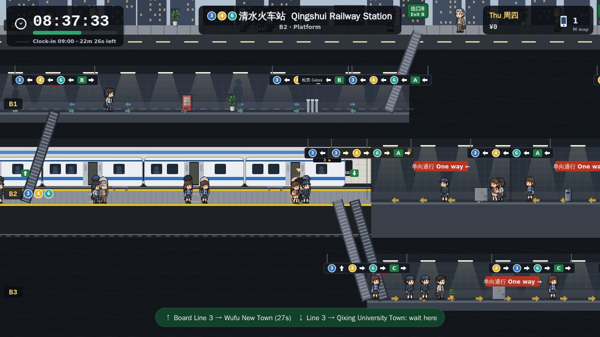
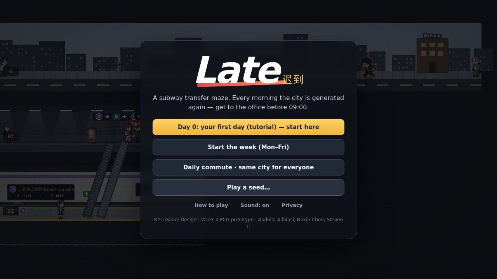
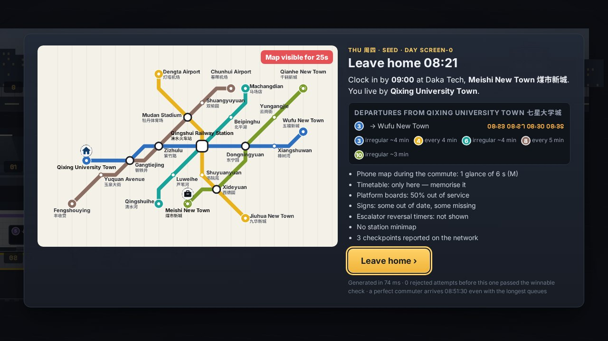
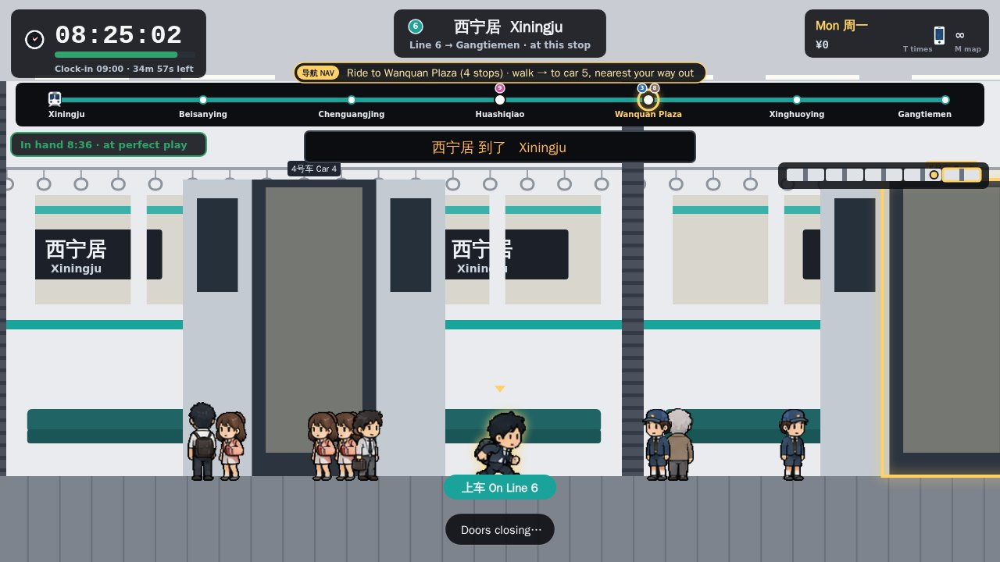
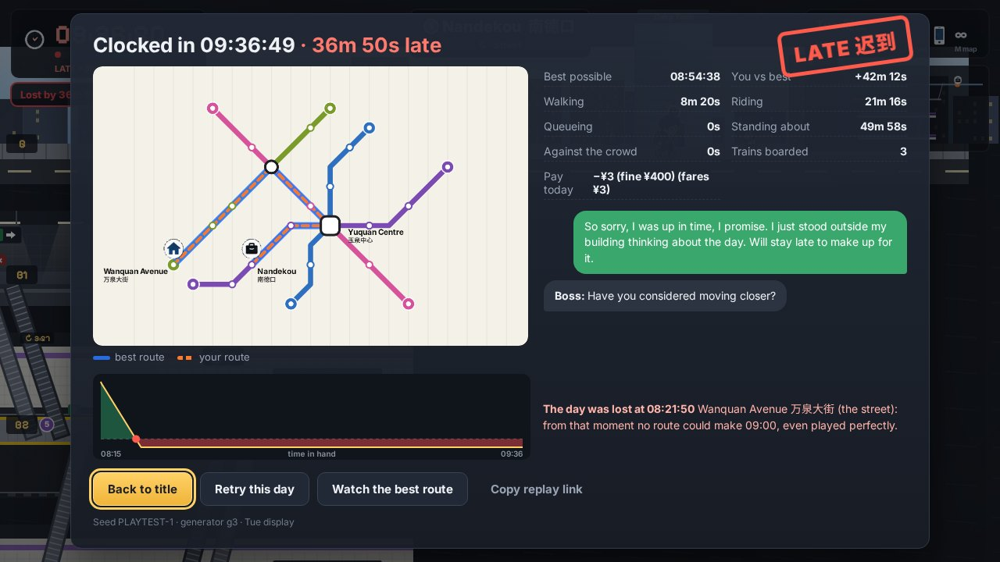
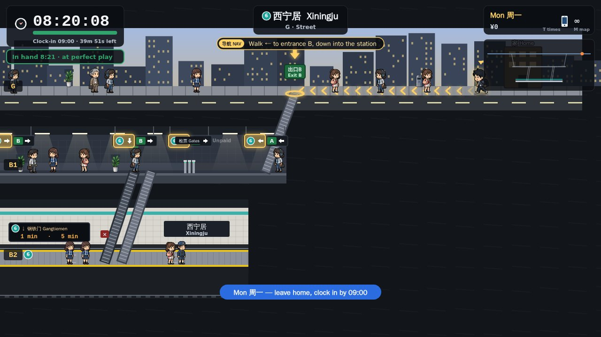
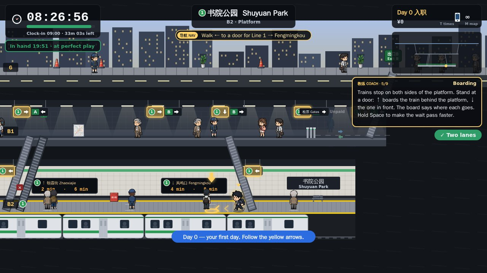
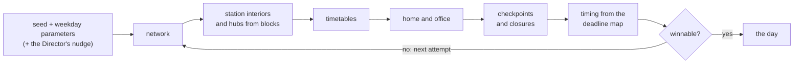

# Late 迟到 — a subway transfer maze

*NYU Game Design, Week 4: Procedural Content Generation*



## Team

- Abdulla Saeed Ghanim Abdulla Alfalasi (asg8972)
- Naxin Chen (nc3840)
- Steven Li (sl10429)

## Mission

Build a game prototype that incorporates PCG: generate the levels, or something else. Using Jev is optional.

## What we built

**Late** is a game about being late for work. Every morning the city's metro is generated again: the lines, the stations and what is inside them, the timetables, and whatever is waiting for you on the way. You leave home at a set time and have to clock in at the office by 09:00.

You see the commute side-on, as a cross-section through the ground: the street, the concourse, the platforms and the passages between them, several levels deep. ← → walk. ↑ and ↓ do whatever makes sense where you stand: take the stairs, escalator or lift, board the train behind or in front of the platform, or step across into the other lane of a passage.

What stands between you and the office:

- **Opposing lanes.** Most passages carry two streams of people going opposite ways. Walk with the crowd at 1.5 m/s, against it at 0.45 m/s, or take a second to step across.
- **One-way corridors** (单向通行). There is always another way back, but it can be a long one.
- **Escalators** run one way, and some reverse every few minutes. Stairs always work but are slower. Lifts run on a cycle.
- **Timetables.** Each line has its own headway, and later in the week some lines run irregularly. Platform boards show the next trains, when they work.
- **Checkpoints** (安检 security, ID checks in passages and at transfer stairs) make you queue for a random time.
- **Closures.** A passage, escalator or staircase can be shut for works.
- **Gates and fares.** Leave the paid area and you pay again to come back in. One kind of hub makes you do it.
- **Doors.** You get off at the door you are standing by, so walk through the carriages (slowly, it is crowded) to the one nearest the exit you need.
- **Hubs.** From Wednesday the route goes through a hub where three or more lines meet. Hubs are built from several blocks: long passages, a maze of one-way passages, two halves joined through the street, or platforms many levels down.

A run is a five-day work week, after an optional **Day 0**: a guided first day on a small, forgiving city where a coach explains each thing the first time you meet it. On Monday a **route guide** shows the way (arrows on the floor, the stairs to take, the train to board, the door to get off at); on Tuesday only the signs for your next line light up; after that you are on your own. Each day the generator adds checkpoints and closures and leaves you less time to lose, and the game shows you less: the map is on screen for 25 s on Thursday and 12 s on Friday, the phone map is rationed to a few glances and then none, platform boards break, and signs go missing or out of date. You earn ¥400 a day (¥15 docked per late minute, plus any fares) and can spend it between days on aids that bring some of the information back. A late day ends with a message to your boss, written from what actually went wrong, and the exact moment the day was lost.

| | |
|---|---|
|  |  |
|  |  |
|  |  |

## How to run

- **Play:** open `index.html` in a browser. Double-clicking it works: the scripts are plain `<script>` files, with no build step, no dependencies and no network needed (the pixel font comes from Google Fonts when you are online; otherwise the page falls back to a system font).
  - Controls: ← → walk · ↑ board the train behind the platform, go up, move to the far lane · ↓ board the train in front, go down, move to the near lane · ↑ or E get off at a stop · hold Space to let time pass · M phone map · T timetable · Esc pause. Touch screens get on-screen buttons.
  - Modes on the title screen: **Day 0** (the tutorial, offered first to a new player), **a work week** (Monday to Friday, with the Director adjusting each day), **the daily commute** (the same city for everyone that day) and **play a seed** (any seed and weekday; also works as a link, e.g. `index.html?seed=K7Q2-M4XP&wd=3`, where `wd` is 0 for Monday to 4 for Friday).
- **Tests:** `node --test` (Node 20 or newer). 49 tests: seed determinism, the winnable check, the corridor rules, the generator's output, the route guide and Day 0, and the leaderboard Worker. The Worker tests need `node:sqlite` (Node 22.13 or newer) and are skipped on older versions.
- **Headless playthrough:** `node tools/playtest.mjs` opens `index.html` from disk in Chromium and plays Monday through the game's real keyboard handler, with the autopilot choosing the keys. `--week` plays Monday to Friday with the shop in between, `--late` dawdles past 09:00 and expects a LATE result, `--daily` plays the daily commute, `--tutorial` plays Day 0 as a new player (doing what the coach asks) and then Monday, both by following only the on-screen guide, and `--shots DIR` saves a screenshot of every phase. Needs Playwright.
- **Sweep:** `node tools/sweep.js --n 40` generates 40 days per weekday, solves and plays each one, and prints the report the improvement loop is built on (`--out FILE.md` saves it).
- **Sprites:** `python3 tools/extract_sprites.py` rebuilds `assets/sprites.png` and `src/ui/atlas.js` from the team's sheet in `resources/sprite.png` (needs Pillow).

## How our PCG works

Everything in `src/core/` is plain JavaScript with no DOM, so the same files run in the browser, under `node --test`, and in the leaderboard Worker. A day is a pure function of a seed string and the weekday's difficulty parameters: `generateDay(seed, paramsFor(weekday))`. All randomness comes from `rng.js`, a seeded generator split into labelled streams, so changing one step does not reshuffle the others. The generator version is part of the seed hash, so after a generator change an old seed gives a new day under a new version, never a different day passed off under the old one.



1. **Network** (`network.js`, `names.js`). Lines are routed with A* on a 20 × 13 grid in the octilinear style of a metro map (bends of 0, 45 or 90 degrees). The first three lines are forced through the centre, which becomes the hub; wherever lines share a grid point there is an interchange. Stations are spaced every 2–3 grid units. Station names are built in Chinese and pinyin from morphemes, with a blocklist so the city does not land on a famous real station.
2. **Station interiors** (`interior.js`). Each station is a cross-section: floor segments at depths (0 street, 1 concourse, 2 and below platforms and passages) joined by links (stairs, escalators, lifts, fare gates, and joints inside passages). A plain station is one block with an island or two stacked side platforms; an interchange is two blocks, stacked, cross-platform, side by side, or side by side and joined by paired one-way passages. A hub gives each line its own block (three or four blocks; a fifth line shares one), linked in one of four flavours: **sprawl** (long passages between blocks), **maze** (paired one-way passages on two levels, easy to take the wrong one), **split** (two halves with no paid link: out through the gates, along the unpaid underpass, and back in with a new fare) and **deep** (platforms several levels down, reached by chains of escalators and a lift).
3. **Corridor types** (`rules.js`). Every floor is two-way, one-way or opposing (two lanes flowing opposite ways); every escalator has a direction, and some have a reversal timer. The rules live in one file shared by the solver and the simulation, so the generator's promises and the game's behaviour cannot drift apart.
4. **Timetables** (`timetable.js`). Each line runs both ways with a headway of 2½–5 minutes. From Tuesday some lines are irregular (each gap jittered), which is what makes remembering the timetable worth something. Trains never overtake.
5. **Home and office** (`day.js`). A pair of stations whose best route has the weekday's shape: the number of transfers, a trip of 14–55 minutes, and from Wednesday a route through the hub.
6. **Checkpoints and closures.** Placed one at a time on the route at the real start time, re-timing the day after each. Candidate spots are scored by how much earlier you would have to leave home if that spot were blocked; spots a typical commuter would rather queue at than walk around are preferred; if a placement breaks the day's shape, the next spot is tried.
7. **Timing** (`solver.js`). A reverse solver gives, for every place in the city, the latest time you can be there and still clock in: the *deadline map*. The day starts `slack` seconds before the latest time a **human-paced** commuter (10 s to decide at every stair or gate, 8 s to step onto a train) could leave home, rounded down to the minute. So a day's slack is the time you can afford to lose, not how early the best route arrives.
8. **The winnable check.** A time-dependent shortest-path solver (exact, because every edge is first-in-first-out) must reach the office at least a minute early with the longest possible queue at every checkpoint. The human-paced commuter must also have at least a minute in hand. A reachability check must find no traps (places you can get into but not out of). The route a typical commuter takes must still have the day's shape, and every checkpoint must have been placed. If anything fails, the attempt is thrown away and the next attempt number runs. Generating a day takes a median of 9 ms on Monday and 100 ms on Friday.

The simulation (`sim.js`) plays the same rules in fixed steps of a quarter of a game second, with no clocks and no `Math.random` (queue times come from a hash of the seed, the checkpoint and the visit). The autopilot (`autopilot.js`) presses the keys a perfect or a hesitant commuter would. The tests use it to prove that what the generator promises can actually be walked.

The **route guide** (`guide.js`) reuses the same solver while you play: from wherever you stand it plans the rest of the way at a human pace and says the next step. It plans again whenever you change floor, lane or train, in under a millisecond, so going the wrong way never strands it. **Day 0** is the same generator on its own setting (`difficulty.tutorialParams`: three lines, one change, no checkpoints or closures, 15 minutes to spare) with one fixed seed, `DAY-ZERO`. We picked it from eight candidates as the one whose route passes stairs, an escalator, fare gates, two-lane passages and a change of line.

## How PCG adds to our game

- **A commute you cannot memorise.** Every day is a new city and timetable, so you read the signs, the boards and the map instead of remembering a route. Then the week takes the reading away.
- **Difficulty as numbers.** A weekday is a row of parameters, not a hand-built level: lines, transfers, checkpoints, closures, irregular timetables, hub flavours and slack. The Director reads how your last two days went and nudges the next day's slack, queue lengths and closures. It never builds anything itself.
- **Fair by construction, and checked.** Every day is solved before you see it, with the worst queues and at human pace, and the sweep plays hundreds of days to check that this holds (see [The improvement loop](#the-improvement-loop)). Being late should be your fault, not the generator's.
- **Help that works on any city.** A hand-made tutorial level would teach one layout; the route guide works out the next step on whatever city was generated today, which is what lets Monday hold your hand and the rest of the week let go.
- **A day that can explain itself.** Because the deadline map covers every place and moment, the game knows how much time you have in hand anywhere: a live meter on Monday and Tuesday, and at the end of every day a graph of your time in hand and the moment it ran out ("The day was lost at 08:21:50 on Wanquan Avenue"). The message to the boss is picked from what happened in your run.
- **Shared days.** A day is its seed, so the daily commute is the same city for everyone, a seed can be sent as a link, and the leaderboard can check a run by replaying it.

Hand-made, not generated: the rules, the art (the team's sprite sheet), the text templates, and the display policy (what you are shown on each weekday).

## Difficulty across the week

There are two separate knobs. The **generator parameters** (`src/core/difficulty.js`) decide what gets built. The **display policy** (`src/core/display.js`) decides what you are shown. The display policy is not an input to the generator, so the same day can be played under any policy; the tests check that no display setting is among the generator's parameters and that each weekday shows strictly less than the one before.

| | Mon | Tue | Wed | Thu | Fri |
|---|---|---|---|---|---|
| **Generator** | | | | | |
| lines | 4 | 4 | 5 | 5 | 6 |
| transfers on the best route | 1 | 1–2 | 1–2 | 2–3 | 2–3 |
| route must go through the hub | | | yes | yes | yes |
| hub flavours | sprawl | sprawl, split | sprawl, split, maze | maze, split, deep | maze, deep, split |
| checkpoints | 0 | 1 | 2 | 3 | 4 |
| closures | 0 | 0 | 1 | 1 | 2 |
| slack (time a human-paced commuter can lose) | 7:00 | 5:30 | 4:30 | 3:30 | 3:00 |
| irregular lines | 0% | 25% | 40% | 50% | 60% |
| **Display** | | | | | |
| map in the morning | as long as you like | as long as you like | as long as you like | 25 s | 12 s |
| phone map (M) | any time | any time | 3 glances | 1 glance | none |
| route hint · exit hint | yes · yes | no · yes | no · yes | no · no | no · no |
| timetable (T) | any time | any time | morning only | morning only | none |
| working boards · signs shown · signs out of date | 100% · 100% · 0% | 100% · 100% · 0% | 85% · 90% · 10% | 50% · 80% · 20% | 20% · 60% · 30% |
| escalator reversal timers | yes | yes | | | |
| station minimap · time-in-hand meter | yes · yes | yes · yes | yes · no | no · no | no · no |
| transfer lines on the train's strip | yes | yes | yes | yes | |
| route guide | whole path | lit signs | | | |

Aids from the shop loosen the display policy for a day (more phone glances, working boards and lit signs, unlimited time over the map, fixed signs). They never change the generated day. Day 0 shows everything Monday does, plus the coach.

## The improvement loop

After the first playable version (0.1) we measured before adding anything. `tools/sweep.js` generates 40 fixed seeds per weekday, solves each day, plays it with a perfect and a hesitant autopilot, and flags days that are **trivial** (checkpoints nobody meets, a start so loose it does not matter), **unfair** (a pinch point with under 10 s to spare, a hesitant commuter who is late on a day that passed the check) or **dull** (mostly riding, or a route that never meets an opposing lane or a one-way corridor). We ran the loop twice. What changed and why is in [`CHANGELOG.md`](CHANGELOG.md); the full reports are in [`docs/sweeps/`](docs/sweeps/).

| 40 fixed seeds per weekday | 0.1 | 0.2 | 0.3 |
|---|---|---|---|
| hesitant commuter late (Tue–Fri) | 8–20% | 0% | 0% |
| days with a pinch point under 10 s (Thu / Fri) | 15% / 15% | 0% / 0% | 0% / 5% |
| worst tenth of Thursdays: time a perfect player can lose | 10 s | 265 s | 261 s |
| best routes that hop off a train to change cars | 15–35% | 0% | 0% |
| routes that walk an opposing-lane or one-way corridor | 40–70% | 95–100% | 95–100% |
| checkpoints a typical commuter meets (Tue / Fri) | not measured | 0.80 / 1.68 | 0.85 / 1.95 |
| attempts per Friday day | 1.8 | 2.5 | 1.5 |
| Friday generation time (median) | 24 ms | 111 ms | 100 ms |

**Then playtesting (0.4).** People who tried it said there was nothing to teach the controls and that the first day was too hard: new players got lost on Monday. So 0.4 adds Day 0 and the route guide, which fades from the whole path on Monday to lit signs on Tuesday to nothing. A hesitant player (10 s at every stair or gate) who does only what the guide says is on time on all 40 Monday and all 40 Tuesday sweep days. Building it also turned up a bug that made the timetable impossible to close with T.

The sweep also exposed two rules bugs (the solver could plan a lane change where ↑ means "climb", and could put you in the far lane where the simulation puts you in the near one) and an exploit: the best route hopped off at a stop, walked along the platform and got back on the same train to change cars. The fix was a new rule rather than a patch: you can walk through the carriages. The two Friday days with a 6-second pinch point on the fastest route are a known, accepted case; a safer route remains, and the hesitant commuter is never late on them.

## Telemetry and leaderboard

Both are implemented, following our Week 3 game ([`game-design-projects/week3`](https://github.com/game-design-projects/week3)), **but not deployed**. The two endpoints in `src/ui/telemetry.js` are `null`, so nothing leaves the browser, and the game says so ("Our collector is not deployed yet", "Leaderboard not deployed yet"). The game works fully with both off.

- **Telemetry (opt-in, anonymous).** A first-run card asks, and declining is one click. Sessions are always kept on the device first (Privacy on the title screen exports them as JSON or deletes them). Only with consent and a configured endpoint is a finished session sent, with `sendBeacon`. The only identifier is a random id made in the browser. The collector (`server/`, a Cloudflare Worker with a D1 database) never reads IP, User-Agent or location, and a test checks the code for it. Each session carries the seed, weekday, the Director's adjustment and the generator version, so any day a player saw can be regenerated.
- **Daily-commute leaderboard.** You submit the board, the generator version and your key presses, never a time. The Worker regenerates the day with the game's own `src/core`, replays the inputs in the same simulation and computes the arrival itself, refusing malformed, stale or unfinished runs. It keeps each player's best, shows nicknames only, never returns player ids, and lets a moderator delete entries with a token. Scores are stored per generator version, so a generator change cannot mix runs of different days.
- **Tests.** `test/worker.test.mjs` runs the Worker against real SQLite (`node:sqlite`) behind a small D1 stand-in.
- **Cost and limits.** Replaying a day takes under 5 ms, but regenerating it takes 20–100 ms, more than the Workers free plan's 10 ms of CPU per request, so the Worker keeps recent days in memory; a busy board would need the paid plan or a shared cache. A replay proves a run is possible, not that a person played it, and there is no rate limiting yet.

To deploy: `cd server && npm install`, `npx wrangler d1 create late-telemetry` and put the id it prints into `wrangler.toml`, `npm run db:migrate`, `npx wrangler secret put READ_TOKEN`, `npm run deploy`, then set `TELEMETRY_ENDPOINT` and `LEADERBOARD_ENDPOINT` in `src/ui/telemetry.js` to the Worker's `/v1/sessions` and `/v1/scores` URLs.

## What building it answered

- **rot.js or hand-written?** Hand-written. A side-on cross-section with lanes, links and timetables does not fit a tile-map library, and the core had to run unchanged in Node and in a Worker, so it has no dependencies at all.
- **How long is a day?** At human pace, one to two and a half real minutes (median 71 s on Monday, 117 s on Friday). The game clock runs 12 times faster than real time while you walk, 36 times while you queue, and 40 times while your train is moving.
- **Can the Worker afford to check a run?** Replaying it, yes (under 5 ms, about 50 input changes per day). Regenerating the day costs more, so the Worker keeps it in memory.
- **What does it take to reproduce a day?** The seed, the weekday, the Director's adjustment and the generator version.
- **Can a hub be annoying but fair?** Building hubs from blocks gave us the annoying part (a hub transfer takes a median of about five game minutes); timing the day from the deadline map at human pace gave us the fair part.
- **Was the first day fair to a new player?** By the numbers, yes; in playtesting, no. The solver said Monday could be won, but a new player did not know the controls and got lost in the first station. Solving a day is not the same as a person being able to read it, so 0.4 adds a tutorial and has the solver guide the player on Monday.
- **Still open:** whether the difficulty we compute matches the difficulty players feel. That is what the telemetry is for once it is deployed. We did not use Jev.

## Project layout

```
index.html, styles.css   the game: plain scripts, no build step
src/core/                the generator and everything that must agree with it (no DOM; runs in Node)
  rng.js                   seeded randomness in labelled streams
  names.js, network.js     the metro map
  interior.js              station cross-sections, hubs from blocks
  rules.js                 walking speeds, lanes, escalators, lifts, doors, timings
  timetable.js             headways and trips
  solver.js                the day as a graph, time-dependent shortest paths, the deadline map
  difficulty.js            generator parameters per weekday, the Director
  day.js                   the pipeline and the winnable check
  sim.js, autopilot.js     the playable rules in fixed steps, and a player for them
  display.js, wayfinding.js  what the player is shown each weekday, and the signs
  analysis.js, excuses.js  time in hand, the moment a day was lost, the message to the boss
  guide.js                 the route guide: the next step from wherever you stand
src/ui/                  canvas views, HUD, screens, input, audio, the Day 0 coach, telemetry and leaderboard clients
assets/sprites.png       sprites cut from the team's sheet (resources/sprite.png)
server/                  Cloudflare Worker + D1: telemetry collector and leaderboard
test/                    node --test suites
tools/                   headless playtest, sweep, sprite extraction
docs/sweeps/             the sweep report for each version
docs/screenshots/        the screenshots in this README
idea.md                  the requirements and the ideas we started from
CHANGELOG.md             what changed between versions, and why
```

## Research notes

- [`research/sok-pcg.md`](research/sok-pcg.md): comparison of PCG content types, layout algorithms, and quality-control strategies.
- [`research/sok-pcg-genres.md`](research/sok-pcg-genres.md): how PCG is used across game genres.
